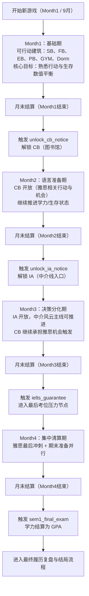

# 玩家视角 4 个月节奏流程图（Demo）

本图用于描述当前 Demo（4 回合）下，玩家在每个月份会经历的关键解锁与主线压力节点。

## 说明

- 该流程图与当前事件调度常量保持同步：`unlock_cb_notice` -> `unlock_ia_notice` -> `ielts_guarantee` -> `sem1_final_exam`。
- 若后续调整了建筑解锁顺序、特殊事件触发月份、或回合结构，请同步更新本文件。
